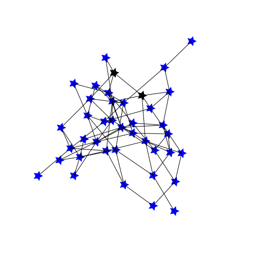

## Examples

Some examples of what `JGraphs` together with `Javis` might help you animate!



```julia
    startinglayout = Spring(dim=2)
    startingscaling = 50
    
    layout2 = Shell()
    scaling2 = 100
    
    layout3 = SquareGrid()
    scaling3 = 20
    
    n_frames = 500
    mst_frames = 1:400
    myg = Video(500, 500)
    Background(1:n_frames, ground("white", "black"))
    g2 = erdos_renyi(40, 0.1)
    gd2 = JGraphData(g2, 
        startinglayout, 
        scaling=startingscaling, 
        frames=mst_frames, 
        edge_width=1
    )
    myJGraph = JGraph(gd2)
    jgraph_morph(myJGraph, layout2, scaling2, frames=51:150)
    jgraph_morph(myJGraph, layout3, scaling3, frames=201:300)
    jgraph_morph(myJGraph, startinglayout, startingscaling, frames=351:451)
    render(myg, pathname="../JGraphs/docs/src/assets/example1.gif")
```